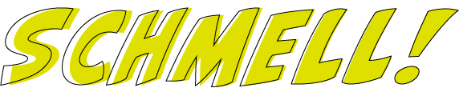

<div id="top"></div>

[![CC BY-NC-SA 4.0][cc-by-nc-sa-image]][cc-by-nc-sa]

![reactnative-badge]
![typescript-badge]
![css3-badge]
![realm-badge]
![redux-badge]
[![Stargazers][stars-shield]][stars-url]
[![Issues][issues-shield]][issues-url]
[![LinkedIn][linkedin-shield]][linkedin-url]


<!-- PROJECT LOGO -->
<br />
<div align="center">
  <a href="https://github.com/francinv/schmell-app">
    
  </a>

<h3 align="center">Schmell!</h3>

  <p align="center">
    This is an mobile application built with React Native. I have used TypeScript as the language for development. The mobile application is a drinking game. The app will fetch the games from an admin panel, which is the backend (<a href="https://github.com/francinv/schmell-admin-panel">Schmell Admin Panel</a>). 
    <br />
    <br />
    <a href="https://www.figma.com/proto/EmW0vHUR2csgMbMWuvhksb/Schmell-APP?page-id=0%3A1&node-id=5%3A2&viewport=241%2C48%2C0.1&scaling=scale-down&starting-point-node-id=5%3A2&show-proto-sidebar=1">View Prototype</a>
    ·
    <a href="https://github.com/francinv/schmell-app/issues">Report Bug</a>
    ·
    <a href="https://github.com/francinv/schmell-app/issues">Request Feature</a>
  </p>
</div>


<!-- TABLE OF CONTENTS -->
<details>
  <summary>Table of Contents</summary>
  <ol>
    <li>
      <a href="#about-the-project">About The Project</a>
      <ul>
        <li><a href="#built-with">Built With</a></li>
      </ul>
    </li>
    <li>
      <a href="#getting-started">Getting Started</a>
      <ul>
        <li><a href="#prerequisites">Prerequisites</a></li>
        <li><a href="#installation">Installation</a></li>
        <li><a href="#running">Running</a></li>
      </ul>
    </li>
    <li><a href="#roadmap">Roadmap</a></li>
    <li><a href="#license">License</a></li>
    <li><a href="#contact">Contact</a></li>
  </ol>
</details>


<!-- ABOUT THE PROJECT -->
## About The Project

[![Product Name Screen Shot][product-screenshot]](https://www.figma.com/proto/EmW0vHUR2csgMbMWuvhksb/Schmell-APP?page-id=0%3A1&node-id=5%3A2&viewport=241%2C48%2C0.1&scaling=scale-down&starting-point-node-id=5%3A2&show-proto-sidebar=1)

As mentioned the application is a drinking game for every party. The app will contain many different games, and the questions will be updated every other week. Later on we will implement a store, where the user can buy more games. 

<p align="right">(<a href="#top">back to top</a>)</p>


### Built With

* [ReactNative.js](https://reactnative.dev/)

<p align="right">(<a href="#top">back to top</a>)</p>


<!-- GETTING STARTED -->
## Getting Started

The app will be uploaded to apple App Store and Google Play Store in summer of 2022.
Before this you can test the app out locally.

### Prerequisites

This is an example of how to list things you need to use the software and how to install them.
* npm
  ```sh
  npm install npm@latest -g
  ```

### Installation

1. Clone the repo
   ```sh
   git clone https://github.com/francinv/schmell-app.git
   ```
2. Install NPM packages
   ```sh
   npm install
   ```

### Running
You need to have installed a iOS simulator or Android simulator. [Read the docs for more information.](https://reactnative.dev/docs/running-on-device)

1. Start the metro server
    ```sh
    npx react-native start
    ```
2. Start the application
    ```sh
    npx react-native run-ios/run-android
    ```


<p align="right">(<a href="#top">back to top</a>)</p>


<!-- ROADMAP -->
## Roadmap

- [ ] Redux
- [ ] Realm DB
- [ ] Connect with server
- [ ] Connect with Apple Store Connect and Google Play Console
- [ ] GameOverview 
- [ ] Settings page

See the [open issues](https://github.com/francinv/schmell-app/issues) for a full list of proposed features (and known issues).

<p align="right">(<a href="#top">back to top</a>)</p>


<!-- LICENSE -->
## License

This work is licensed under a [Creative Commons Attribution-NonCommercial-ShareAlike 4.0 International License][cc-by-nc-sa]. See `LICENSE` for more information.

<p align="right">(<a href="#top">back to top</a>)</p>


<!-- CONTACT -->
## Contact

Francin Vincent - [@francinvincent](https://no.linkedin.com/in/francinvincent) - francin.vinc@gmail.com

Project Link: [https://github.com/francinv/schmell-app](https://github.com/francinv/schmell-app)

<p align="right">(<a href="#top">back to top</a>)</p>


<!-- MARKDOWN LINKS & IMAGES -->
<!-- https://www.markdownguide.org/basic-syntax/#reference-style-links -->
[stars-shield]: https://img.shields.io/github/stars/francinv/schmell-app.svg?style=for-the-badge
[stars-url]: https://github.com/francinv/schmell-app/stargazers
[issues-shield]: https://img.shields.io/github/issues/francinv/schmell-app.svg?style=for-the-badge
[issues-url]: https://github.com/francinv/schmell-app/issues
[linkedin-shield]: https://img.shields.io/badge/-LinkedIn-black.svg?style=for-the-badge&logo=linkedin&colorB=555
[linkedin-url]: https://no.linkedin.com/in/francinvincent
[product-screenshot]: docs/asset.png
[cc-by-nc-sa]: http://creativecommons.org/licenses/by-nc-sa/4.0/
[cc-by-nc-sa-image]: https://licensebuttons.net/l/by-nc-sa/4.0/88x31.png
[typescript-badge]: https://img.shields.io/badge/TypeScript-007ACC?style=for-the-badge&logo=typescript&logoColor=white
[reactnative-badge]: https://img.shields.io/badge/React_Native-20232A?style=for-the-badge&logo=react&logoColor=61DAFB
[css3-badge]: https://img.shields.io/badge/CSS3-1572B6?style=for-the-badge&logo=css3&logoColor=white
[realm-badge]: https://img.shields.io/badge/Realm-39477F?style=for-the-badge&logo=realm&logoColor=white
[redux-badge]: https://img.shields.io/badge/Redux-593D88?style=for-the-badge&logo=redux&logoColor=white